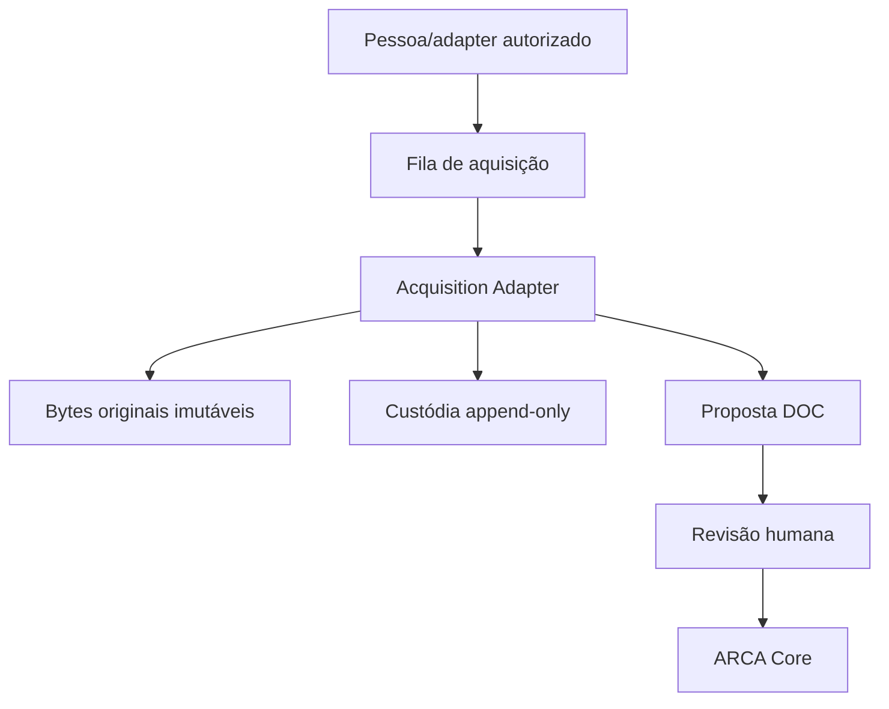

# ARCA Acquisition & Chain of Custody Specification v0.3.0

**Status:** marco funcional pré-produção  
**Versão do adaptador:** 0.3.0  
**Protocolo canônico consumido:** ARCA Core Protocol 1.0.0  
**Contrato de proposta consumido:** arca-agent-proposal-v1

## 1. Finalidade

O Acquisition Adapter transforma bytes obtidos por acesso legítimo em um registro local verificável, sem atribuir verdade ao conteúdo e sem escrever diretamente no event log do ARCA Core. O adaptador preserva o original, calcula SHA-256 sobre os bytes realmente lidos, registra proveniência declarada e produz uma proposta de objeto `DOC` sujeita a revisão humana.

Aquisição prova o que foi capturado e como foi tratado. Não prova que o documento é verdadeiro, completo, autêntico na origem ou suficiente para uma conclusão.

## 2. Fronteira arquitetural



O Adapter pode ler arquivo regular dentro de raiz autorizada, preservar bytes, calcular hashes, registrar transformação e revisão e enfileirar intenção. Ele não realiza busca autônoma, não contorna autenticação, não invade área privada, não aceita symlink como fonte, não altera originais e não escreve em `investigations/*/events.ndjson`.

## 3. Estrutura local

```text
ARCA_HOME/
├── acquisitions/
│   └── INV-.../
│       └── ACQ-.../
│           ├── custody.ndjson
│           ├── manifest.json
│           ├── original/
│           │   └── <nome-sanitizado>
│           └── derivatives/
│               └── <sha256>-<nome>
└── queues/
    └── acquisition/
        └── QAQ-....json
```

`custody.ndjson` é a fonte de verdade da custódia. `manifest.json` é projeção regenerável. O event log do Core permanece separado e soberano para o estado canônico da investigação.

## 4. Captura original

Uma captura aceita somente arquivo regular. A implementação:

1. valida IDs e campos fechados;
2. exige base e declaração de acesso;
3. resolve a raiz física autorizada;
4. rejeita traversal e link simbólico;
5. abre o arquivo sem seguir link quando a plataforma oferece `O_NOFOLLOW`;
6. limita tamanho antes e durante a leitura;
7. detecta mudança durante a leitura;
8. grava cópia byte a byte por escrita atômica;
9. calcula SHA-256 local sobre o buffer lido;
10. registra `ACQUISITION_CAPTURED`;
11. projeta `manifest.json`;
12. devolve proposta `create_object/DOC` com revisão humana obrigatória.

## 5. Proveniência mínima

A captura registra:

- `acquisitionId` e `investigationId`;
- `sourceId` declarado;
- título;
- localizador declarado;
- instante de acesso RFC 3339 UTC;
- método de aquisição;
- base e declaração de acesso;
- tipo de mídia;
- nome preservado;
- caminho relativo interno;
- tamanho em bytes;
- algoritmo e hash real;
- ator que realizou a captura.

Localizador e timestamp são alegações declaradas, não inferências automáticas.

## 6. Cadeia de eventos

Eventos seguem `arca-custody-event-v1`:

- `ACQUISITION_CAPTURED`;
- `TRANSFORMATION_RECORDED`;
- `REVIEW_RECORDED`.

Cada evento contém sequência, tipo, instante de registro, ator, payload, hash anterior e `eventHash`. O hash é SHA-256 da serialização canônica do evento sem o próprio `eventHash`.

Eventos anteriores nunca são reescritos. Transformações criam derivados; não substituem o original. Revisões registram decisão humana sem apagar incertezas.

## 7. Transformações

Toda transformação deve declarar:

- hash de entrada já pertencente à cadeia;
- hash e tamanho do resultado;
- caminho do derivado preservado;
- ferramenta, versão e parâmetros;
- instante;
- ator;
- tipo de mídia.

OCR, conversão, extração de texto, redaction e normalização são transformações. O resultado nunca herda silenciosamente o status do original.

## 8. Revisão

A revisão aceita `accepted`, `rejected` ou `needs-work`, com notas, instante e ator. `accepted` significa que bytes e metadados foram conferidos no escopo declarado; não concede selo e não confirma o conteúdo factual.

## 9. Filas e acesso legítimo

A fila armazena intenção, não credencial e não conteúdo obtido. Toda entrada exige declaração de acesso e nasce com:

- `status: pending-human-or-authorized-adapter`;
- `networkActionPerformed: false`.

Um conector futuro deverá possuir contrato próprio, respeitar robots, termos, autenticação e limites aplicáveis e registrar o resultado como captura. A fila não autoriza contornar barreiras.

## 10. Segurança

- raiz e IDs validados antes de formar caminhos;
- resolução física e contenção;
- recusa de symlink;
- limite de 25 MiB por padrão;
- diretórios `0700` e arquivos `0600` quando suportados;
- arquivo temporário, `fsync` e rename;
- lock por aquisição para novos eventos;
- hashes SHA-256 sobre bytes;
- verificação de original, derivados, cadeia e projeção;
- zero dependências externas de runtime;
- nenhuma rede no pacote de aquisição.

Hashes locais detectam alteração; não substituem assinatura, timestamp confiável externo ou atestação independente.

## 11. Proposta ao Core

A captura retorna uma proposta `arca-agent-proposal-v1` de uma única operação `create_object`, tipo `DOC`. Ela inclui localizador, método, instante, SHA-256 e caminho do manifesto. O Core só recebe a operação após confirmação humana pelo fluxo existente do Agent Bundle.

## 12. Compatibilidade

O protocolo e schemas do Core continuam `1.0.0/v1`. Logs e exportações 0.1.0/0.2.0 permanecem reconstruíveis. O novo pacote é uma borda externa; nenhuma regra epistêmica foi movida para ele.

## 13. Testes de aceitação

Os 12 testes novos, numerados 31–42, verificam bytes reais, hash real, proveniência declarada, adulteração do original, symlink, traversal, limite de tamanho, transformação, revisão, adulteração da cadeia, fila sem rede e ausência de escrita direta no Core. Somados aos 30 testes preservados do sistema 0.2.0, formam a suíte de 42 testes.
