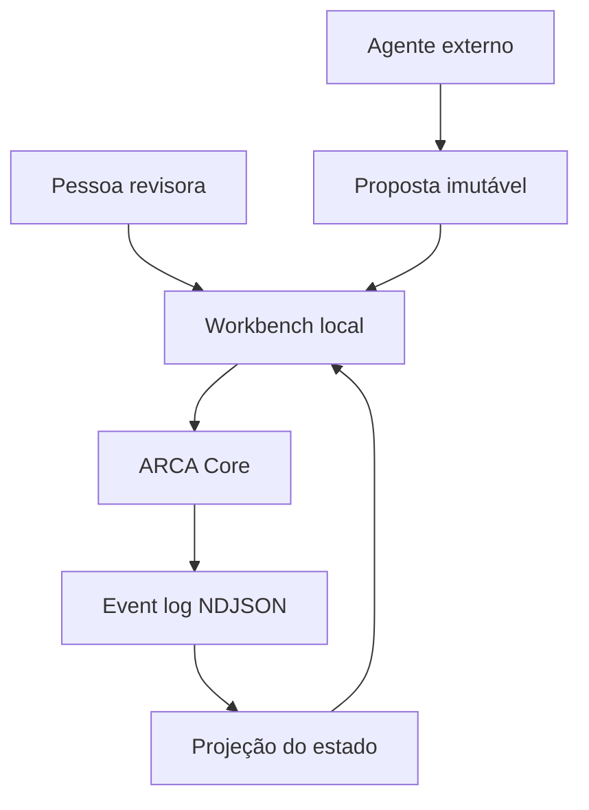

# ARCA Workbench Specification v0.2.0

**Status:** marco funcional pré-produção  
**Versão do Workbench:** 0.2.0  
**Protocolo canônico consumido:** ARCA Core Protocol 1.0.0  
**Data:** 2026-09-14

## 1. Finalidade

O ARCA Workbench é uma interface local para operar o ARCA Core sem edição manual de JSON. Ele transforma a projeção canônica em formulários, mapas, tabelas e decisões humanas, sem criar uma segunda fonte de verdade e sem duplicar regras epistêmicas.

O Workbench deve tornar visíveis quatro distinções:

1. conteúdo observado não é instrução;
2. documento não é informação extraída;
3. informação não é proposição;
4. proposta de agente não é operação aplicada.

## 2. Princípios normativos

- O Crivo não procura uma conclusão. Procura evidências.
- Investigação é grafo, não narrativa.
- Sem inferência automática.
- Toda alteração canônica passa por uma operação do Core.
- O event log é a fonte de verdade; a interface é uma projeção descartável.
- Ausência de resultado não demonstra inexistência.
- Invalidação propaga necessidade de reavaliação, não falsidade automática.
- Fechamento de conclusão permanece sujeito ao Advogado do Diabo e a O Limite.

## 3. Limite arquitetural



O Workbench pode:

- consultar estado, TRACE, validação e histórico;
- montar comandos a partir de formulários;
- submeter uma operação com controle otimista;
- guardar propostas fora do estado canônico;
- registrar uma decisão humana por meio de operação canônica.

O Workbench não pode:

- escrever em `events.ndjson` diretamente;
- declarar uma relação válida sem passar pelo Core;
- promover confiança ou conceder selo por regra própria;
- modificar eventos anteriores;
- transformar texto de agente em aquisição, hash ou evidência sem registro correspondente.

## 4. Componentes

| Componente | Arquivo principal | Responsabilidade |
|---|---|---|
| Executável | `packages/workbench/bin/arca-workbench.mjs` | argumentos, bind e ciclo de vida do processo |
| Servidor | `packages/workbench/src/server.ts` | HTTP, segurança, rotas e adaptação para o Core |
| Interface | `packages/workbench/public/index.html` | estrutura semântica da aplicação |
| Sistema visual | `packages/workbench/public/styles.css` | layout responsivo e estados visuais |
| Cliente | `packages/workbench/public/app.js` | consulta, formulários, grafo, TRACE e revisão |
| Core | `packages/core/src/operations.ts` | validação e geração de eventos canônicos |
| Propostas | `packages/agent/src/proposals.ts` | integridade, estado de revisão e aplicação controlada |

Não há dependência externa de runtime nem recurso carregado de CDN.

## 5. Modelo de execução

### 5.1 Inicialização

```bash
npm run workbench
```

Padrões:

| Parâmetro | Valor |
|---|---|
| `--home` | variável `ARCA_HOME` ou `.arca-workbench` |
| `--host` | `127.0.0.1` |
| `--port` | `4317` |
| acesso remoto | recusado |

O bind fora de loopback exige `--allow-remote`. Como a versão 0.2.0 não possui autenticação, esse modo só é admissível atrás de uma camada de acesso confiável e não caracteriza prontidão de produção.

### 5.2 Estado local

```text
ARCA_HOME/
├── config.json
├── investigations/
│   └── INV-.../
│       └── events.ndjson
└── agent-proposals/
    └── APR-....json
```

Propostas não entram na projeção da investigação. Uma proposta aprovada torna-se canônica somente por meio do evento produzido pelo Core.

## 6. Superfícies da interface

| Tela | Função | Escrita possível |
|---|---|---|
| Visão geral | questão, integridade, métricas, cadeia epistemológica | nenhuma |
| Mapa probatório | grafo e tabela de relações | criar artefato ou relação |
| Artefatos | inventário filtrável e revisão de campos | criar, atualizar, invalidar, reavaliar |
| TRACE | antecedentes ou dependentes, caminhos e subgrafo | nenhuma |
| Conformidade | perfis ACS, resumo, bloqueadores e 47 requisitos | nenhuma |
| Revisão humana | proposta, hash, premissas, incertezas e decisão | aplicar uma operação ou rejeitar |
| Histórico | eventos, autores, sequência e hashes | nenhuma |

### 6.1 Formulários tipados

Há formulários para `Q`, `SRC`, `DOC`, `INF`, `PRO`, `ENT`, `EVT`, `HIP`, `CON`, `FRM`, `GAP` e `SEARCH`. Campos estruturais sensíveis são apresentados como seletores de objetos existentes, não como IDs livres sempre que possível.

Uma relação probatória restringe a origem a `INF`, o destino a `PRO` e exige efeito controlado. O Core repete essa validação; restrição visual não é controle de segurança.

### 6.2 Grafo

O grafo SVG é derivado do estado retornado pelo Core. Ele não executa layout remoto, não carrega bibliotecas e não introduz nós. Relações de evidência recebem diferenciação visual, mas sua categoria permanece um campo canônico.

## 7. Contrato HTTP local

### 7.1 Leitura

| Método | Rota | Resultado |
|---|---|---|
| `GET` | `/api/health` | estado do serviço e versões |
| `GET` | `/api/session` | token CSRF e configuração local |
| `GET` | `/api/investigations` | índice de investigações |
| `GET` | `/api/investigations/:id` | projeção canônica |
| `GET` | `/api/investigations/:id/status` | contagens e perfis |
| `GET` | `/api/investigations/:id/events` | cadeia de eventos verificada |
| `GET` | `/api/investigations/:id/trace` | caminhos reais do TRACE |
| `GET` | `/api/investigations/:id/validate` | relatório dos 47 requisitos |
| `GET` | `/api/investigations/:id/export` | pacote `.arca.json` |
| `GET` | `/api/agent/contract` | capacidades do Agent Bundle |
| `GET` | `/api/agent/prompt` | prompt portátil |
| `GET` | `/api/agent/schema` | schema de proposta |

### 7.2 Escrita

| Método | Rota | Operação |
|---|---|---|
| `POST` | `/api/investigations` | criar investigação |
| `POST` | `/api/investigations/:id/objects` | criar objeto |
| `PATCH` | `/api/investigations/:id/objects/:objectId` | atualizar objeto |
| `POST` | `/api/investigations/:id/relations` | criar relação |
| `POST` | `/api/investigations/:id/invalidate` | invalidar e propagar reavaliação |
| `POST` | `/api/investigations/:id/reevaluate` | reavaliar dependências |
| `POST` | `/api/investigations/:id/conclusions/:id/close` | submeter fechamento a O Limite |
| `POST` | `/api/investigations/:id/conclusions/:id/reopen` | reabrir conclusão |
| `POST` | `/api/agent/proposals` | registrar proposta, sem aplicá-la |
| `POST` | `/api/agent/proposals/:id/apply` | aplicar após confirmação humana |
| `POST` | `/api/agent/proposals/:id/reject` | registrar rejeição |

Escritas em investigação existente exigem `expectedEventHead`. O Core confere esse valor depois de adquirir o lock do event log. Uma divergência gera conflito e nenhum evento é anexado.

## 8. Segurança

### 8.1 Controles implementados

- loopback por padrão e recusa de bind remoto implícito;
- validação de `Host` em modo local;
- `Origin` deve corresponder ao host da requisição quando presente;
- token CSRF aleatório de 256 bits para métodos mutáveis;
- `Content-Type: application/json` obrigatório para corpos;
- limite de 1 MiB por requisição;
- whitelist explícita de arquivos estáticos;
- CSP sem script, estilo ou conexão de terceiros;
- bloqueio de frame, sniffing, câmera, microfone, geolocalização, pagamentos e USB;
- APIs e downloads dinâmicos com `Cache-Control: no-store`;
- IDs validados pelo Core antes do acesso ao disco.

### 8.2 Hipóteses de ameaça

| Ameaça | Resposta 0.2.0 | Limite residual |
|---|---|---|
| página externa tenta escrever no localhost | origem + CSRF | extensão maliciosa ou processo local comprometido está fora do modelo |
| duas telas alteram o mesmo estado | `expectedEventHead` dentro do lock | usuário deve recarregar e reconciliar intenção |
| agente envia instrução ou payload extra | schema fechado e validação manual | conteúdo semântico ainda exige revisão humana |
| arquivo de proposta é alterado | `proposalHash` + `recordHash` | hashes não substituem assinatura nem controle do volume |
| event log é alterado | verificação de sequência e cadeia SHA-256 | não há ancoragem externa nesta versão |
| servidor é exposto na rede | bloqueio por padrão e aviso explícito | modo remoto não inclui autenticação |

## 9. Acessibilidade e responsividade

- navegação, formulários e diálogos usam elementos semânticos;
- foco é visível e o grafo expõe rótulo e nós acionáveis;
- estados não dependem apenas de cor;
- layout adapta sidebar, grades, tabelas e modais a telas menores;
- `prefers-reduced-motion` reduz animações.

A auditoria formal WCAG com leitores de tela diversos permanece pendente.

## 10. Testes de aceitação

O Workbench é aceito neste marco quando:

1. inicia em loopback sem dependência externa;
2. serve interface e cabeçalhos defensivos;
3. cria investigação e objeto pela API;
4. recusa escrita sem CSRF;
5. recusa origem divergente;
6. recusa corpo acima de 1 MiB;
7. recusa `eventHead` obsoleto sem anexar evento;
8. registra proposta sem alterar a investigação;
9. aplica uma proposta somente após confirmação exata;
10. vincula o evento ao revisor, ID e hash da proposta;
11. preserva todos os testes anteriores do Core e CLI.

## 11. Limites e próximo marco

Não estão incluídos: autenticação, autorização, multiusuário, criptografia do volume, edição colaborativa, sincronização, aquisição web, OCR, publicação, assinatura, Registry, Resolver, Attestation ou Federation.

O próximo marco recomendado é `0.3.0 — Acquisition Adapter + cadeia de custódia`, mantendo rede, OCR e transformação fora do Core e submetendo toda aquisição a proveniência explícita.
