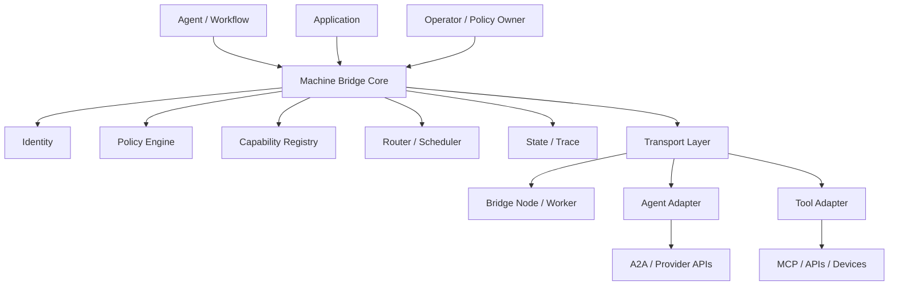
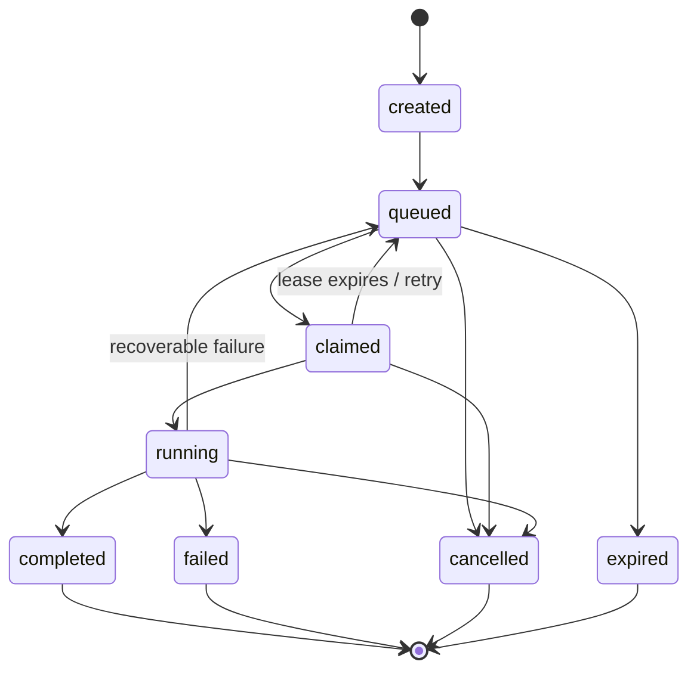
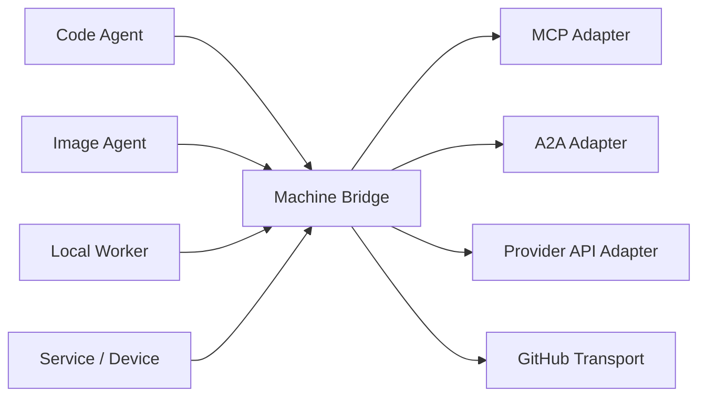
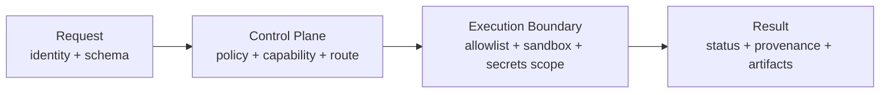

# Machine Bridge Specification v0.1

**Status:** Foundational Release  
**Date:** 16 September 2026  
**Origin:** ARCA Project  
**Reference implementation:** ARCA Machine Bridge V3  
**Scope:** core, participants, capabilities, requests, jobs, claims, leases, results, transports, policies, adapters, security, observability and conformance

> **Founding principle**  
> Remove the human from the role of operational transport between computational intelligences and capabilities, without removing human authority over objectives, permissions and sensitive decisions.

---

## 0. Abstract

Machine Bridge defines a platform-independent coordination architecture that allows agents, machines, tools and services to discover, route and execute capabilities without requiring a human operator to manually relay commands, screenshots, logs or intermediate results between systems.

The architecture is **capability-first**. A caller expresses what capability is required. Participants advertise what they can provide. Policies determine whether execution is authorized. Routing determines where execution should occur. Transports move or persist requests, claims and results. Workers execute only registered and authorized actions.

A conformant implementation MAY use GitHub, filesystem queues, HTTP, WebSocket, message queues, MQTT, A2A, MCP-backed adapters or other transports. Machine Bridge does not require a central server and does not define a specific AI provider.

The ARCA Machine Bridge V3 implementation is the first reference profile. It already provides structured jobs, declared capabilities, durable queues, worker targeting, leases, claims, results, filesystem transport and GitHub transport. This specification generalizes those mechanisms into a provider-independent architecture while preserving V3 compatibility.

---

## 1. Normative language

The key words **MUST**, **MUST NOT**, **SHOULD**, **SHOULD NOT** and **MAY** are normative.

- **MUST / MUST NOT**: mandatory for the applicable conformance profile.
- **SHOULD / SHOULD NOT**: strong recommendation; deviation requires technical justification.
- **MAY**: optional behavior or permitted extension.

### 1.1 Goals

A conformant Machine Bridge architecture is intended to:

1. permit delegation among agents, machines, tools and services without a human relaying each step;
2. decouple caller intent from executor location, vendor and runtime;
3. route work according to capabilities;
4. support asynchronous and durable execution;
5. recover work after worker or transport failure;
6. enforce authorization independently from capability advertisement;
7. preserve sufficient trace and provenance to reconstruct execution;
8. interoperate with external protocols and providers through adapters.

### 1.2 Non-goals

The base specification does not:

- define a particular AI model or reasoning system;
- authorize unrestricted shell or arbitrary-code execution by default;
- eliminate human review for sensitive legal, medical, financial or safety decisions;
- require a Machine Bridge central cloud service;
- define billing, marketplace or commercial settlement rules.

---

## 2. Architectural model



The architecture is based on one abstraction: **a capability**. The identity of the machine or AI that executes a request is secondary to whether it is authorized and able to provide the requested capability.

### 2.1 Terms

| Term | Normative meaning |
|---|---|
| Participant | Identifiable entity that sends, receives, executes or routes requests. |
| Agent | Participant capable of reasoning or orchestration. |
| Node | Runtime connected to the Bridge representing a machine, container, device, service or environment. |
| Worker | Executor that claims jobs and runs actions. |
| Capability | Stable description of something a participant can provide. |
| Action | Executable operation with a stable name and known contract. |
| Request | Universal envelope expressing intent to Machine Bridge. |
| Job | Durable executable unit derived from an execution request. |
| Claim | Temporary declaration that a worker owns a job. |
| Lease | Time limit attached to a claim. |
| Result | Terminal or partial output correlated to a request/job. |
| Artifact | Addressable output referenced outside the main result body. |
| Transport | Mechanism used for delivery, persistence and/or discovery. |
| Adapter | Translation layer between Machine Bridge and an external protocol/provider. |

### 2.2 Architectural invariants

A conformant implementation:

- MUST assign a unique request identifier within its trust domain;
- MUST correlate execution and results to their originating request;
- MUST NOT execute an unregistered or unauthorized action;
- MUST treat capability compatibility as necessary but not sufficient authorization;
- MUST prevent silent semantic mutation by transports;
- SHOULD distinguish transport failure from execution failure when determinable;
- MUST provide an idempotency mechanism for terminal results or explicitly version terminal outcomes.

---

## 3. Components

### 3.1 Machine Bridge Core

The Core performs normalization, validation, correlation and lifecycle management and exposes the logical public interface of the Bridge.

### 3.2 Identity layer

The Identity layer associates participants with stable identifiers, credentials and trust domains. A participant identifier does not need to reveal a civil or real-world identity.

### 3.3 Policy engine

The Policy engine decides whether an otherwise compatible request is authorized. Policy MAY consider participant identity, capability, resource scope, data classification, risk class, runtime class, network access, secrets and execution boundary.

### 3.4 Capability registry

The registry stores or resolves participant capabilities and related metadata. Capability advertisement MUST NOT itself grant permission.

### 3.5 Router / scheduler

The router selects eligible execution targets. Implementations MAY use targeted, role-based, capability-based, fan-out, quorum or failover strategies.

### 3.6 Transport layer

The transport delivers or persists requests, jobs, claims, results and presence. It MAY be durable or ephemeral depending on the conformance profile.

### 3.7 Bridge Node / Worker

A Node exposes authorized capabilities from a runtime. A Worker executes allowed actions after compatibility and policy checks.

### 3.8 Action Registry

The Action Registry is the execution boundary between received data and side effects. Network-provided action names MUST NOT be converted directly into arbitrary shell text.

### 3.9 Adapter layer

Adapters translate between Machine Bridge and systems such as MCP, A2A, model-provider APIs, GitHub, Replit/runners, devices or proprietary protocols.

### 3.10 Observability plane

The observability plane records lifecycle events, traces, metrics, audits and provenance.

---

## 4. Participants and capabilities

### 4.1 Participant descriptor

A participant SHOULD expose a descriptor equivalent to:

```json
{
  "format": "mb-participant-v1",
  "participantId": "worker.replit.01",
  "kind": "worker",
  "capabilities": [
    "node",
    "repository",
    "image.generate"
  ],
  "labels": {
    "provider": "example",
    "runtime": "node"
  },
  "heartbeatAt": "2026-09-16T15:00:00Z"
}
```

Requirements:

- `participantId` MUST be stable within the trust domain.
- `capabilities` MUST contain unique names.
- sensitive labels MUST NOT be exposed to participants without authorization.
- `heartbeatAt` MAY be omitted for purely asynchronous transports.

### 4.2 Capability naming

Capability identifiers SHOULD use stable hierarchical names where useful, for example:

- `repository.test`
- `repository.check`
- `image.generate`
- `browser.test`
- `python.run`
- `pncp.acquire-public`
- `shell.sandboxed`

Declaring `shell` or `shell.sandboxed` MUST NOT automatically authorize arbitrary commands.

---

## 5. Universal request model

Machine Bridge defines a universal request envelope. An implementation MAY map it internally to legacy or provider-specific formats.

```json
{
  "format": "mb-request-v1",
  "version": "0.1",
  "requestId": "req_01JXYZ",
  "kind": "call",
  "from": {
    "participantId": "agent.code.01"
  },
  "to": {
    "capabilities": ["image.generate"]
  },
  "action": "image.generate",
  "input": {
    "prompt": "Generate an application icon"
  },
  "execution": {
    "timeoutMs": 120000,
    "mode": "async",
    "priority": "normal"
  },
  "context": {
    "threadId": "thread_8472",
    "parentRequestId": null
  },
  "idempotencyKey": "project-icon-main-v1"
}
```

### 5.1 Request kinds

| `kind` | Meaning | Direct execution |
|---|---|---|
| `call` | Request an action/capability and expected result. | Yes |
| `message` | Exchange information without implying execution. | No by definition |
| `event` | Announce a state change. | No by definition |
| `artifact` | Publish or reference an artifact. | Not directly |
| `cancel` | Request cancellation of correlated work. | Control operation |
| `stream` | Negotiate incremental output. | Profile-specific |

A receiver MUST NOT interpret `message` as an executable command merely because it contains instructions in natural language. Translation from message to action requires an explicit policy-governed decision.

### 5.2 Target selection

A request MAY identify:

```json
{"to":{"participantId":"worker.replit.01"}}
```

or:

```json
{"to":{"capabilities":["node","repository"]}}
```

or an implementation-defined role/group selector.

Capability-based target selection is RECOMMENDED for provider-independent workflows.

---

## 6. Jobs, queues, claims and leases

Execution requests MAY be materialized as durable jobs.

### 6.1 Job

```json
{
  "format": "mb-job-v1",
  "jobId": "job_01JXYZ",
  "requestId": "req_01JXYZ",
  "action": "repository.test",
  "requires": ["node", "repository"],
  "params": {},
  "createdAt": "2026-09-16T15:00:00Z"
}
```

### 6.2 Claim and lease

When multiple workers can observe the same job, a worker SHOULD acquire a claim before side effects begin.

```json
{
  "format": "mb-claim-v1",
  "jobId": "job_01JXYZ",
  "workerId": "worker.github-actions",
  "attempt": 2,
  "claimedAt": "2026-09-16T15:01:00Z",
  "leaseExpiresAt": "2026-09-16T15:03:00Z"
}
```

A lease:

- MUST expire unless renewed;
- SHOULD be renewed while execution is active;
- MUST prevent a worker from publishing an authoritative result after it has lost ownership, unless the execution profile defines a safe reconciliation mechanism;
- SHOULD permit another worker to recover work after expiration.

### 6.3 Lifecycle



Normative states:

- `created`
- `queued`
- `claimed`
- `running`
- `completed`
- `failed`
- `cancelled`
- `expired`

---

## 7. Execution and Action Registry

A worker MUST execute only actions that are registered or otherwise authorized by an equivalent closed execution policy.

An action descriptor SHOULD include:

```json
{
  "name": "repository.test",
  "requires": ["node", "repository"],
  "riskClass": "low",
  "inputSchema": "schema:repository.test.input:v1",
  "outputSchema": "schema:repository.test.output:v1",
  "sideEffects": "repository-read-or-test"
}
```

### 7.1 Structured process execution

Machine Bridge distinguishes structured process execution from unrestricted shell evaluation.

`process.exec` MAY accept an executable and explicit argument array:

```json
{
  "action": "process.exec",
  "input": {
    "executable": "npm",
    "args": ["test"]
  }
}
```

Implementations MUST NOT implicitly concatenate request data into a shell command string.

### 7.2 Sandboxed shell

`sys.shell.sandboxed` or equivalent MAY exist only where an implementation can enforce the declared execution boundary. Such a worker SHOULD be disposable, secret-minimized and separately permissioned.

A worker that has repository credentials or infrastructure secrets MUST NOT expose unrestricted shell under the same privilege boundary unless the security profile explicitly permits and constrains it.

---

## 8. Results, artifacts and errors

Every accepted execution MUST eventually produce an observable terminal state or an explicit expiration/cancellation condition.

### 8.1 Result

```json
{
  "format": "mb-result-v1",
  "requestId": "req_01JXYZ",
  "jobId": "job_01JXYZ",
  "workerId": "worker.github-actions",
  "attempt": 1,
  "status": "completed",
  "startedAt": "2026-09-16T15:01:00Z",
  "completedAt": "2026-09-16T15:01:44Z",
  "output": {
    "tests": 42,
    "passed": 42
  },
  "artifacts": []
}
```

Terminal results MUST be idempotent by logical execution identity or explicitly versioned.

### 8.2 Error envelope

```json
{
  "error": {
    "code": "ACTION_TIMEOUT",
    "message": "Action exceeded configured timeout",
    "retryable": true
  }
}
```

Errors MUST NOT include secrets. Stack traces, environment variables and detailed logs SHOULD be filtered according to policy.

### 8.3 Artifacts

Large or binary outputs SHOULD be published as addressable artifacts instead of being embedded directly in the result.

```json
{
  "artifactId": "art_7832",
  "mediaType": "image/png",
  "size": 463291,
  "sha256": "...",
  "uri": "mb-artifact://art_7832"
}
```

Artifact resolution MUST be subject to authorization.

---

## 9. Transport Interface

Machine Bridge transports are replaceable.

A transport profile SHOULD provide logical operations equivalent to:

```text
enqueue(request_or_job) -> accepted
list(workerId)          -> jobs[]
claim(jobId, worker)    -> claim | null
renew(jobId, worker)    -> claim
hasResult(jobId)        -> boolean
writeResult(result)     -> stored
register(participant)   -> stored
notify()                -> implementation-specific
```

### 9.1 Durability requirements

A durable transport profile MUST:

- preserve accepted jobs across normal sender/worker restart;
- permit workers to distinguish already-completed work;
- support idempotent result publication or compare-and-set/versioning;
- provide claim/lease or an equivalent concurrency mechanism;
- define its ordering guarantees rather than implying global order.

### 9.2 Reference transports

The ARCA reference implementation currently provides:

- filesystem transport;
- GitHub repository transport with durable JSON state and optimistic write conflicts;
- repository-dispatch wake-up for faster worker activation;
- scheduled recovery path through a controller workflow.

---

## 10. Discovery, routing and scheduling

Routing is policy-aware capability matching.

A worker is eligible only if:

1. the request/job is structurally valid;
2. required capabilities are satisfied;
3. the action is available;
4. identity and authorization policy allow it;
5. runtime constraints are satisfied.

Eligibility does not imply preference. A scheduler MAY consider latency, cost, locality, data classification, queue depth, affinity, GPU/memory, trust domain, provider preference or historical reliability.

Recommended routing modes:

| Mode | Meaning |
|---|---|
| `targeted` | Specific participant. |
| `capability` | Any participant satisfying capabilities and policy. |
| `role/group` | Logical role or group. |
| `fan-out` | Send to multiple executors. |
| `quorum` | Accept after a validation/consensus rule. |
| `failover` | Try sequential executors after failure/timeout. |

---

## 11. Policy and authorization

Capabilities describe what a worker can technically do. Policy decides what it may do for a specific caller and context.

A policy context MAY include:

```json
{
  "subject": "agent.code.01",
  "action": "repository.test",
  "resource": "repo:arca-core",
  "worker": "worker.replit.01",
  "dataClass": "internal",
  "constraints": {
    "network": "deny-except-allowlist",
    "secrets": ["github.readonly"],
    "maxRuntimeMs": 120000
  }
}
```

The policy decision SHOULD be one of `allow`, `deny` or `require-approval` (or an equivalent explicit decision model).

Autonomous profiles MAY omit synchronous human approval for routine operations, but MUST still apply machine-enforced policy before execution.

---

## 12. Agent-to-agent communication and adapters

Machine Bridge is not a replacement for specialized protocols. It provides a capability and execution fabric around them.



Examples:

- an AI coding agent can request `image.generate` from an image agent;
- an investigation agent can request `pncp.acquire-public` from a network-authorized worker;
- an image agent can publish an artifact and return its reference;
- a local worker can expose `python.run` without exposing unrestricted shell;
- an A2A adapter can translate external agent tasks into Machine Bridge requests;
- an MCP adapter can represent tools/resources as Bridge capabilities where semantics permit.

### 12.1 Delegation and handoff

Delegation keeps the caller as orchestrator and creates a correlated request/job. Handoff transfers conversational or operational responsibility to another participant. Adapters SHOULD preserve which semantic mode was used.

---

## 13. Security and isolation

Security is part of the operational protocol, not an optional later layer.



A secure execution profile MUST or SHOULD, as applicable:

- authenticate or establish trust for privileged callers;
- validate schemas, sizes and input bounds;
- authorize both action and resource scope;
- use allowlisted actions;
- isolate high-risk code/shell execution;
- apply least privilege to credentials;
- avoid command, SQL, path and URL injection;
- cap runtime, output size and resource consumption;
- record policy decisions and execution identity;
- distinguish untrusted retrieved content from authorized control instructions.

No capability name is a security grant by itself.

---

## 14. Observability, audit and provenance

A durable implementation SHOULD emit lifecycle events sufficient to reconstruct a request.

Recommended event vocabulary:

- `request.accepted`
- `route.selected`
- `job.queued`
- `claim.created`
- `lease.renewed`
- `execution.started`
- `execution.completed`
- `execution.failed`
- `policy.denied`
- `transport.failure`
- `artifact.published`

Events SHOULD record correlation identifiers, participant identifiers, timestamps and relevant policy/routing metadata while excluding secrets.

Multi-agent workflows SHOULD carry a `threadId`, `traceId`, `parentRequestId` or equivalent causal chain.

---

## 15. Conformance profiles

Implementations MAY declare one or more profiles.

| Profile | Minimum requirements |
|---|---|
| `MB-Core` | Validation, correlation, lifecycle, request/result contract. |
| `MB-Worker` | Participant descriptor, capabilities, action registry and execution correlation. |
| `MB-Durable` | Persistent jobs, claim/lease or equivalent, idempotent results and restart recovery. |
| `MB-Router` | Capability discovery, eligibility checks and routing. |
| `MB-Secure` | Section 13 execution-boundary and least-privilege requirements. |
| `MB-Adapter` | Documented translation to/from an external provider/protocol while preserving semantics. |

A full implementation MAY combine all profiles in one process or distribute them across services.

---

## 16. ARCA Machine Bridge V3 compatibility profile

ARCA Machine Bridge V3 is the first implementation of the architectural principle described by this specification.

Current V3 characteristics include:

- `arca-remote-job-v3` structured jobs;
- required capabilities;
- optional worker targeting;
- bounded action timeout;
- closed Action Registry;
- worker capabilities and registration;
- claims with leases and renewal;
- terminal `arca-result-v1` results;
- filesystem transport;
- GitHub repository transport;
- optimistic GitHub write conflicts for claims/results;
- controller workflow that detects unresolved jobs and wakes the canonical worker;
- fixed repository test/check actions;
- ARCA investigative actions such as analytical triage and PNCP planning/acquisition under explicit capability boundaries.

### 16.1 V3-to-v0.1 mapping

| ARCA V3 | Machine Bridge Specification v0.1 | Notes |
|---|---|---|
| `arca-remote-job-v3` | `mb-request-v1(kind=call)` + `mb-job-v1` | Adapter can map `params` to `input`. |
| `workerTarget` | `to.participantId` | Direct mapping when targeted. |
| worker capabilities | participant capabilities | Direct mapping. |
| `arca-claim-v1` | `mb-claim-v1` | Same lease principle. |
| `arca-result-v1` | `mb-result-v1` | Universal result additionally carries request correlation. |
| `FsMachineBridgeTransport` | filesystem transport profile | Durable local implementation. |
| `GitHubMachineBridgeTransport` | GitHub transport profile | Durable repository-backed implementation. |
| `ActionRegistry` | Action Registry | Existing closed execution boundary. |
| ARCA worker agent | MB-Worker / Bridge Node | Existing worker runtime. |

V3 does not need to be removed. A compatibility adapter SHOULD permit existing V3 jobs/workers to participate while v0.1 clients use the universal envelope.

---

## 17. Normative examples

### 17.1 Code agent delegates image generation

```text
CALLER: code-agent.1
  -> request kind=call
  -> action=image.generate
  -> requires=image.generate

ROUTER:
  -> selects image-agent.2

IMAGE AGENT:
  -> accepts/claims work
  -> generates image
  -> publishes artifact
  -> returns artifact reference

CALLER:
  -> receives result
  -> continues application build
```

The caller does not need to know the image provider API. An adapter/provider MAY be replaced without changing the caller contract.

### 17.2 Distributed ARCA investigation

```text
ARCA Orchestrator
  -> pncp.discovery-public
  -> artifact: records.json
  -> aie.procurement-profile
  -> finding/hypotheses
  -> entity resolution via adapter
  -> document acquisition
  -> evidence validation
  -> report composition
```

Each step MAY be executed by a different authorized participant. The shared trace MUST preserve the causal chain. Analytical signals MUST NOT automatically be converted into legal conclusions.

### 17.3 Local worker without central cloud

```text
Agent A
  -> durable transport (GitHub or filesystem)
Local Worker
  -> claims job with lease
  -> executes registered action
  -> writes result
Agent A later reconnects
  -> reads durable result
```

This profile demonstrates that Machine Bridge does not require sender and worker to be simultaneously online.

---

## 18. Product-neutral evolution roadmap

The following roadmap is informative rather than mandatory:

### 0.1 — Formalization

- universal facade and request contract;
- V3 compatibility adapter;
- conformance profiles;
- capability naming rules.

### 0.2 — Multi-provider

- MCP adapter;
- A2A adapter;
- AI provider adapters;
- explicit capability registry independent from ARCA.

### 0.3 — Bridge Node

- installable runtime;
- local-first discovery;
- policy engine;
- health/presence model;
- artifact handling.

### 0.4 — Hub optionality

- hosted or self-hosted router;
- dashboard and observability;
- team identity and permissions;
- multi-transport routing.

### 0.5 — Advanced orchestration

- DAG workflows;
- fan-out/fan-in;
- quorum validation;
- failover;
- dynamic capability negotiation;
- durable multi-agent threads.

### 1.0 — Stable interoperable contract

- versioned wire semantics;
- conformance suite;
- documented security profiles;
- stable adapter interface;
- reference SDKs.

---

## Appendix A — Recommended identifier forms

| Object | Example |
|---|---|
| request | `req_01...` |
| job | `job_01...` |
| participant | `worker.replit.01` |
| artifact | `art_01...` |
| thread | `thread_01...` |
| action | `repository.test` |
| capability | `image.generate` |

Identifiers SHOULD be opaque or stable within the intended trust domain and SHOULD NOT encode secrets.

---

## Appendix B — Recommended error codes

| Code | Retryable | Meaning |
|---|---|---|
| `INVALID_REQUEST` | No | Schema or envelope invalid. |
| `UNAUTHORIZED` | No/conditional | Caller or policy disallows operation. |
| `CAPABILITY_UNAVAILABLE` | Yes | No eligible executor currently available. |
| `ACTION_UNAVAILABLE` | Conditional | Target does not expose requested action. |
| `CLAIM_CONFLICT` | Yes | Another worker owns the valid claim. |
| `LEASE_EXPIRED` | Yes | Worker lost execution lease. |
| `ACTION_TIMEOUT` | Yes/conditional | Action exceeded runtime bound. |
| `EXECUTION_FAILED` | Conditional | Action execution failed. |
| `TRANSPORT_FAILURE` | Yes | Transport delivery/persistence failed. |
| `ARTIFACT_UNAVAILABLE` | Yes/conditional | Artifact cannot currently be resolved. |

---

## Appendix C — Implementation checklist

A conformant implementer should be able to answer:

- Is every accepted request assigned a unique ID?
- Are capabilities declared and validated?
- Are actions executable only through an allowlist/registry or equivalent boundary?
- Is execution compatibility checked before side effects?
- Is authorization distinct from capability matching?
- Can work recover after worker failure where the selected profile claims durability?
- Are terminal results idempotent or versioned?
- Are policies applied before privileged execution?
- Is shell/code execution isolated according to its risk profile?
- Are secrets minimized and prevented from entering ordinary results/logs?
- Are artifacts integrity-addressable or otherwise verifiable?
- Can the execution chain be reconstructed through correlation/provenance?
- Is there an explicit declaration of supported conformance profiles?

---

## Appendix D — Reference implementation files

At the time of this specification, the ARCA reference implementation includes the following key surfaces:

- `src/machine-bridge/protocol-v3.mjs`
- `src/machine-bridge/action-registry.mjs`
- `src/machine-bridge/worker-runtime.mjs`
- `src/machine-bridge/lease.mjs`
- `src/machine-bridge/fs-transport.mjs`
- `src/machine-bridge/github-transport.mjs`
- `scripts/arca-worker-agent.mjs`
- `.github/workflows/arca-machine-bridge.yml`
- `.github/workflows/arca-machine-bridge-dispatch.yml`

These files constitute an implementation reference, not the entirety of the protocol definition.

---

## Closing statement

Machine Bridge 0.1 formalizes the architecture whose practical origin was simple: remove the human from repeatedly carrying operational information between independent computational systems. The architecture generalizes that solution into a durable capability fabric for agents, machines, tools and services.

The system is intentionally designed so that autonomy can increase without equating autonomy with absence of control. Human authority remains at the level of objectives, policy and sensitive decisions; routine operational transport, routing and execution can move into verifiable machine-enforced infrastructure.

**Machine Bridge — connect capabilities, not vendors.**
